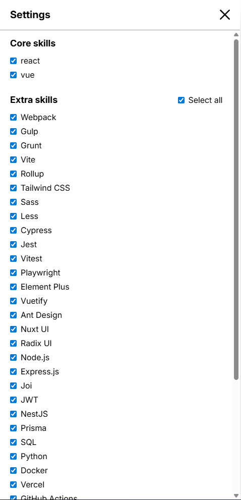

# Resume

Personal resume constructor built with React Router, React, TypeScript, and Tailwind CSS.

## Demo

GitHub Pages URL: https://andrei-dyminski-apps.github.io/text-cv-constructor/

## Resume PDF

[Open PDF](public/assets/examples/resume.pdf)

## Highlights

- Skill-based filtering for experience (React/Vue)
- Data-driven content in `app/data/resume.ts` (used by `app/providers/data.tsx`)
- SPA-mode React Router app (SSR disabled)

## GitHub Pages

1) Push to `main` and enable GitHub Pages for the repo:
   - Settings > Pages > Source: GitHub Actions
2) The workflow deploys `build/client` automatically.

## Project Structure

- `app/` - routes, components, and data
- `public/` - static assets

## Requirements

- Node.js 18+
- npm

## Scripts

```bash
npm install
npm run dev
```

```bash
npm run build
npm run start
```

```bash
npm run typecheck
npm run lint
```

## Screenshots

